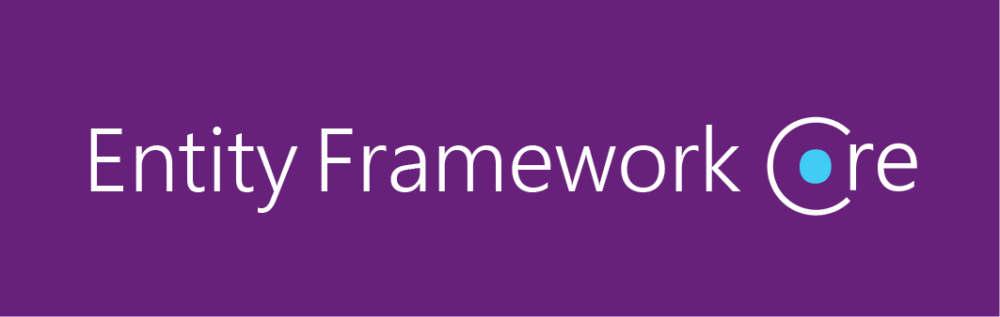
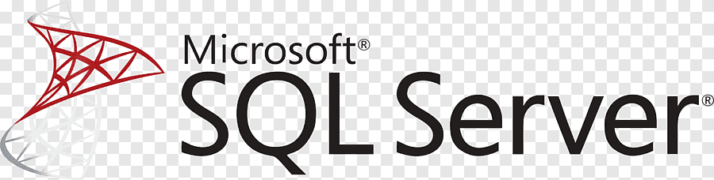

# KatmanlıMimariMVCProject

## Kullanılan Teknolojiler

- **ASP.NET Core MVC**:  
  Modern, yüksek performanslı web uygulamaları geliştirmek için Microsoft'un sunduğu framework.  
  

- **Entity Framework Core**:  
  .NET platformu için hafif ve genişletilebilir bir nesne-ilişkisel eşleme (ORM) aracı.  
  

- **SQL Server**:  
  Güçlü ve ölçeklenebilir bir veritabanı yönetim sistemi.  
  

- **Bootstrap**:  
  Duyarlı ve modern tasarımlar oluşturmak için kullanılan popüler bir CSS framework'ü.  
  
